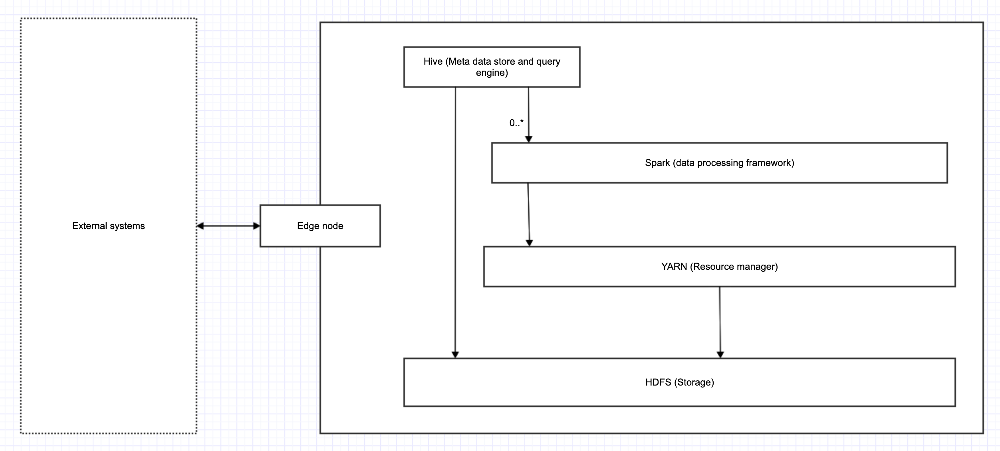
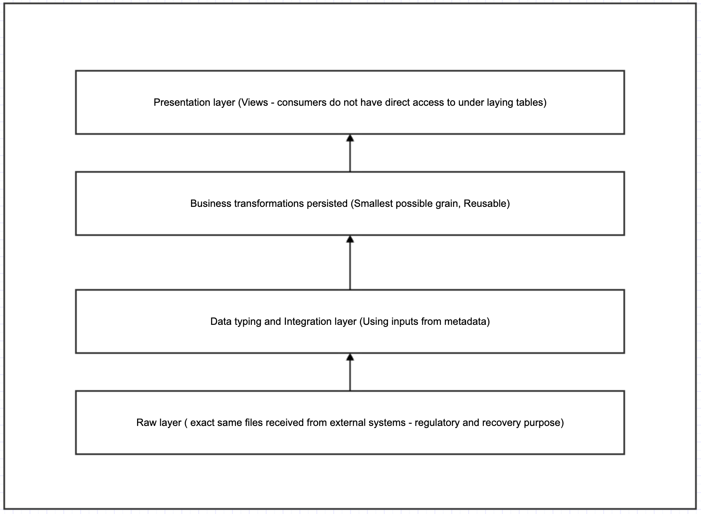

Purchase Transactions
======================

## Problem statement
We have a transaction data flowing in from a source. The types of transactions would be either a purchase, a refund or a void transaction. Both refund transactions and the void transactions would have a parent transaction. Considering that we have millions of transactions flowing in from the source; we need to find the total refunds per customer each month.
When finding total refunds,
 1. Any transaction which has any of its child transaction as a void transaction should be ignored.
 
 2. Any refund transaction for which the parent transaction happened in the same month also should be ignored.

Implement the derivation of the total refunds monthly feature

## Solution description
This solution uses the Hadoop eco-system with following following components

1. HDFS as file system 
2. YARN as resource manager
3. Spark as processing framework
4. Hive as the data access store
5. Parquet as file format

#### Assumptions and considerations
1. External system send purchase transactions as text files to edge node. Secure file transfer protocols can be used here.
2. The files landed in edge node are uploaded to HDFS with data-watcher and upload jobs at regular intervals.
3. Meta-data about these text files is captured separately and using that metadata text files are processed  
   to have proper data-typing for the columns stored as parquet files with Hive tables created on top of it.
4. Spark job reads data from hive tables ans performs operations on it and write the results back to Hive and HDFS.

#### Additional components that can be included
1. Central meta data capturing tools like Alation.
2. Job orchestration and scheduling tools like Apache Airflow.
3. Reporting tools like Tableau.
4. Access control tools like Apache Sentry

### Tech stack

### Data architecture

#### Trial run of this application

1. Pull docker image  (System Requirements : Docker Desktop, Min. 8 GB RAM, Min. 6 GB Disk Space) 
   
   docker pull vineethmm/hadoop_env3
   
   It is a very basic image to run spark jobs, the packaged program in this repo is present in the image,
   along with some test data to run the job

1. Start and docket container 

   docker run --hostname cust-purchase-app-host --name refund-app -it --entrypoint /bin/bash vineethmm/hadoop_env3:latest

2. Start hadoop daemons    
   start-all.sh

3. Submit the spark application
   
   ./submit-application.sh  

4. Start thrift-server

   start-thriftserver.sh    

5. Start beeline shell

   beeline -u jdbc:hive2://localhost:10000  

6. Execute query 

   "select * from customer_refund_trans"
   
 
 ## Alternate tech stacks 
 1. Another solution would be making use of AWS cloud services. We could store data in Amazone S3 file system. Making use of
 EMR (Elastic map-reduce) service to run spark jobs on top of it. One catch here is data-locality. EMR does not guarantee
 data local processing. However evaluations show performance is not that degrade. 
 
 2. Instead of using EMR, we could run spark on EKS (Elastic Kubernetes Service). In fully containerised mode, data can still
 sit on S3
 
 3. Another stack would be using GCP Dataflow and Apache Beam
 
       